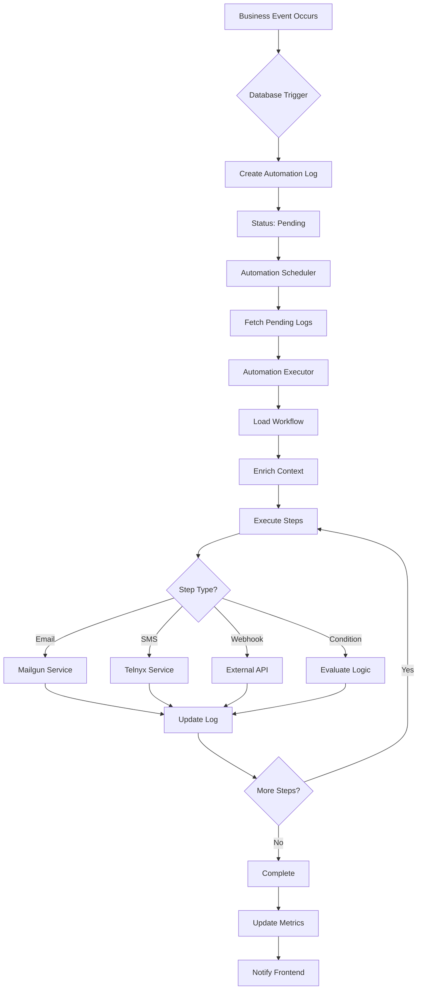

# Fixlify Automation System Architecture
## Complete Technical Architecture & Implementation Guide

---

## 📋 Table of Contents
1. [System Overview](#system-overview)
2. [Architecture Diagram](#architecture-diagram)
3. [Core Components](#core-components)
4. [Data Flow](#data-flow)
5. [Implementation Details](#implementation-details)
6. [Database Schema](#database-schema)
7. [Edge Functions](#edge-functions)
8. [Frontend Integration](#frontend-integration)
9. [Backend Services](#backend-services)
10. [Trigger Mechanisms](#trigger-mechanisms)
11. [Error Handling & Recovery](#error-handling--recovery)
12. [Monitoring & Analytics](#monitoring--analytics)
13. [Scalability & Performance](#scalability--performance)
14. [Security Considerations](#security-considerations)

---

## 🎯 System Overview

The Fixlify Automation System is a comprehensive workflow automation platform that enables automated actions based on business events. It supports multi-channel communications (Email, SMS, Push, Webhooks) and integrates deeply with all business operations.

### Key Objectives
- **Event-Driven Architecture**: React to business events in real-time
- **Multi-Channel Communication**: Support various communication channels
- **Visual Workflow Builder**: No-code automation creation
- **Scalable Processing**: Handle thousands of automations efficiently
- **Reliable Execution**: Ensure all automations run with retry logic
- **Analytics & Monitoring**: Track performance and success rates

---

## 🏗️ Architecture Diagram

```
┌─────────────────────────────────────────────────────────────────────┐
│                           FRONTEND LAYER                             │
├─────────────────────────────────────────────────────────────────────┤
│  ┌──────────────┐  ┌─────────────────┐  ┌──────────────────────┐  │
│  │  Workflow    │  │  Automation     │  │   Execution        │  │
│  │  Builder     │  │  Dashboard      │  │   Monitor          │  │
│  └──────┬───────┘  └────────┬────────┘  └──────────┬───────────┘  │
└─────────┼───────────────────┼───────────────────────┼──────────────┘
          │                   │                       │
          ▼                   ▼                       ▼
┌─────────────────────────────────────────────────────────────────────┐
│                         SUPABASE LAYER                              │
├─────────────────────────────────────────────────────────────────────┤
│  ┌──────────────────────────────────────────────────────────────┐  │
│  │                    PostgreSQL Database                        │  │
│  ├────────────────────────────────────────────────────────────── │  │
│  │  • automation_workflows    • automation_execution_logs        │  │
│  │  • automation_templates    • automation_metrics               │  │
│  │  • workflow_nodes          • workflow_edges                   │  │
│  └──────────────────────────────────────────────────────────────┘  │
│                                                                      │
│  ┌──────────────────────────────────────────────────────────────┐  │
│  │                    Database Triggers                          │  │
│  ├────────────────────────────────────────────────────────────── │  │
│  │  • handle_job_automation_triggers                             │  │
│  │  • handle_invoice_automation_triggers                         │  │
│  │  • handle_client_automation_triggers                          │  │
│  │  • handle_estimate_automation_triggers                        │  │
│  └──────────────────────────────────────────────────────────────┘  │
│                                                                      │
│  ┌──────────────────────────────────────────────────────────────┐  │
│  │                       Realtime                                │  │
│  ├────────────────────────────────────────────────────────────── │  │
│  │  • Workflow status updates                                    │  │
│  │  • Execution progress                                         │  │
│  │  • Error notifications                                        │  │
│  └──────────────────────────────────────────────────────────────┘  │
└─────────────────────────────────────────────────────────────────────┘
          │                   │                       │
          ▼                   ▼                       ▼
┌─────────────────────────────────────────────────────────────────────┐
│                      EDGE FUNCTIONS LAYER                           │
├─────────────────────────────────────────────────────────────────────┤
│  ┌──────────────┐  ┌─────────────────┐  ┌──────────────────────┐  │
│  │ Automation   │  │  Automation     │  │   Communication    │  │
│  │ Scheduler    │  │  Executor       │  │   Services         │  │
│  └──────┬───────┘  └────────┬────────┘  └──────────┬───────────┘  │
│         │                   │                       │              │
│         ▼                   ▼                       ▼              │
│  ┌──────────────────────────────────────────────────────────────┐  │
│  │              Process Automation Pipeline                      │  │
│  │  1. Fetch pending logs                                       │  │
│  │  2. Enrich with context                                      │  │
│  │  3. Execute workflow steps                                   │  │
│  │  4. Handle responses                                         │  │
│  │  5. Update execution status                                  │  │
│  └──────────────────────────────────────────────────────────────┘  │
└─────────────────────────────────────────────────────────────────────┘
          │                   │                       │
          ▼                   ▼                       ▼
┌─────────────────────────────────────────────────────────────────────┐
│                    EXTERNAL SERVICES LAYER                          │
├─────────────────────────────────────────────────────────────────────┤
│  ┌──────────────┐  ┌─────────────────┐  ┌──────────────────────┐  │
│  │   Mailgun    │  │     Telnyx      │  │      Webhooks      │  │
│  │   (Email)    │  │     (SMS)       │  │   (Integrations)   │  │
│  └──────────────┘  └─────────────────┘  └──────────────────────┘  │
└─────────────────────────────────────────────────────────────────────┘
```

---

## 🔧 Core Components

### 1. Workflow Engine
```typescript
interface WorkflowEngine {
  // Core workflow management
  workflows: AutomationWorkflow[];
  templates: WorkflowTemplate[];
  
  // Execution engine
  executor: WorkflowExecutor;
  scheduler: WorkflowScheduler;
  
  // Visual builder
  builder: {
    nodes: WorkflowNode[];
    edges: WorkflowEdge[];
    canvas: ReactFlowInstance;
  };
}
```

### 2. Trigger System
```typescript
interface TriggerSystem {
  eventTypes: {
    // Job triggers
    job_created: TriggerConfig;
    job_status_changed: TriggerConfig;
    job_completed: TriggerConfig;
    job_overdue: TriggerConfig;
    
    // Invoice triggers
    invoice_created: TriggerConfig;
    invoice_sent: TriggerConfig;
    invoice_paid: TriggerConfig;
    invoice_overdue: TriggerConfig;
    
    // Client triggers
    client_created: TriggerConfig;
    client_updated: TriggerConfig;
    client_inactive: TriggerConfig;
    
    // Time-based triggers
    scheduled: TriggerConfig;
    recurring: TriggerConfig;
  };
}
```

### 3. Action System
```typescript
interface ActionSystem {
  actionTypes: {
    // Communication actions
    send_email: ActionConfig;
    send_sms: ActionConfig;
    send_push_notification: ActionConfig;
    
    // Data actions
    update_record: ActionConfig;
    create_task: ActionConfig;
    assign_technician: ActionConfig;
    
    // Integration actions
    webhook: ActionConfig;
    api_call: ActionConfig;
    
    // Control flow
    condition: ActionConfig;
    delay: ActionConfig;
    loop: ActionConfig;
  };
}
```

---

## 🔄 Data Flow

### Complete Automation Lifecycle



---

## 💻 Implementation Details

### Frontend Implementation

```typescript
// src/hooks/useAutomation.ts
export const useAutomation = () => {
  const supabase = useSupabase();
  
  // Real-time workflow updates
  useEffect(() => {
    const channel = supabase
      .channel('automation-updates')
      .on('postgres_changes', {
        event: '*',
        schema: 'public',
        table: 'automation_execution_logs'
      }, (payload) => {
        handleAutomationUpdate(payload);
      })
      .subscribe();
      
    return () => {
      supabase.removeChannel(channel);
    };
  }, []);
  
  // Trigger automation manually
  const triggerAutomation = async (workflowId: string, context: any) => {
    const { data, error } = await supabase.functions.invoke('automation-executor', {
      body: {
        workflowId,
        context,
        manual: true
      }
    });
    
    return { data, error };
  };
  
  // Monitor execution
  const monitorExecution = (executionId: string) => {
    return supabase
      .from('automation_execution_logs')
      .select('*')
      .eq('id', executionId)
      .single();
  };
  
  return {
    triggerAutomation,
    monitorExecution
  };
};
```

### Backend Services

```typescript
// Edge Function: automation-scheduler
import { createClient } from '@supabase/supabase-js';

Deno.serve(async (req) => {
  const supabase = createClient(
    Deno.env.get('SUPABASE_URL')!,
    Deno.env.get('SUPABASE_SERVICE_ROLE_KEY')!
  );
  
  // Fetch pending automations
  const { data: pendingLogs } = await supabase
    .from('automation_execution_logs')
    .select('*')
    .in('status', ['pending', 'retry'])
    .order('created_at', { ascending: true })
    .limit(50);
  
  // Process each log
  for (const log of pendingLogs || []) {
    try {
      // Call executor
      await supabase.functions.invoke('automation-executor', {
        body: {
          workflowId: log.workflow_id,
          context: log.trigger_data,
          executionId: log.id
        }
      });
    } catch (error) {
      console.error(`Failed to process ${log.id}:`, error);
      
      // Update retry count
      await supabase
        .from('automation_execution_logs')
        .update({
          status: 'retry',
          retry_count: (log.retry_count || 0) + 1,
          error_message: error.message
        })
        .eq('id', log.id);
    }
  }
  
  return new Response(JSON.stringify({ 
    processed: pendingLogs?.length || 0 
  }));
});
```

---

## 🗄️ Database Schema

### Core Tables

```sql
-- Automation Workflows
CREATE TABLE automation_workflows (
  id UUID PRIMARY KEY DEFAULT gen_random_uuid(),
  organization_id UUID NOT NULL,
  name VARCHAR(255) NOT NULL,
  description TEXT,
  
  -- Trigger configuration
  trigger_type VARCHAR(50) NOT NULL,
  trigger_config JSONB DEFAULT '{}',
  
  -- Workflow definition
  nodes JSONB DEFAULT '[]',
  edges JSONB DEFAULT '[]',
  steps JSONB DEFAULT '[]',
  
  -- Status and metrics
  is_active BOOLEAN DEFAULT true,
  execution_count INTEGER DEFAULT 0,
  success_count INTEGER DEFAULT 0,
  failure_count INTEGER DEFAULT 0,
  last_triggered_at TIMESTAMPTZ,
  
  -- Metadata
  created_by UUID,
  created_at TIMESTAMPTZ DEFAULT NOW(),
  updated_at TIMESTAMPTZ DEFAULT NOW()
);

-- Execution Logs
CREATE TABLE automation_execution_logs (
  id UUID PRIMARY KEY DEFAULT gen_random_uuid(),
  workflow_id UUID REFERENCES automation_workflows(id),
  organization_id UUID NOT NULL,
  
  -- Trigger information
  trigger_type VARCHAR(50) NOT NULL,
  trigger_data JSONB NOT NULL,
  
  -- Execution details
  status VARCHAR(20) NOT NULL, -- pending, processing, completed, failed, retry
  actions_executed JSONB DEFAULT '[]',
  error_message TEXT,
  retry_count INTEGER DEFAULT 0,
  
  -- Timing
  started_at TIMESTAMPTZ,
  completed_at TIMESTAMPTZ,
  execution_time_ms INTEGER,
  
  -- Metadata
  created_at TIMESTAMPTZ DEFAULT NOW()
);

-- Workflow Templates
CREATE TABLE automation_templates (
  id UUID PRIMARY KEY DEFAULT gen_random_uuid(),
  name VARCHAR(255) NOT NULL,
  description TEXT,
  category VARCHAR(50),
  
  -- Template definition
  trigger_type VARCHAR(50),
  nodes JSONB DEFAULT '[]',
  edges JSONB DEFAULT '[]',
  steps JSONB DEFAULT '[]',
  
  -- Usage tracking
  usage_count INTEGER DEFAULT 0,
  rating DECIMAL(3,2),
  
  -- Metadata
  is_public BOOLEAN DEFAULT false,
  created_by UUID,
  created_at TIMESTAMPTZ DEFAULT NOW()
);

-- Automation Metrics
CREATE TABLE automation_metrics (
  id UUID PRIMARY KEY DEFAULT gen_random_uuid(),
  workflow_id UUID REFERENCES automation_workflows(id),
  
  -- Time period
  period_start TIMESTAMPTZ NOT NULL,
  period_end TIMESTAMPTZ NOT NULL,
  
  -- Metrics
  total_executions INTEGER DEFAULT 0,
  successful_executions INTEGER DEFAULT 0,
  failed_executions INTEGER DEFAULT 0,
  average_execution_time_ms INTEGER,
  
  -- Channel metrics
  emails_sent INTEGER DEFAULT 0,
  sms_sent INTEGER DEFAULT 0,
  webhooks_sent INTEGER DEFAULT 0,
  
  created_at TIMESTAMPTZ DEFAULT NOW()
);

-- Indexes for performance
CREATE INDEX idx_workflows_org_active ON automation_workflows(organization_id, is_active);
CREATE INDEX idx_logs_workflow_status ON automation_execution_logs(workflow_id, status);
CREATE INDEX idx_logs_created_status ON automation_execution_logs(created_at, status);
CREATE INDEX idx_metrics_workflow_period ON automation_metrics(workflow_id, period_start);
```

---

## ⚡ Edge Functions

### 1. automation-scheduler (Cron Job)