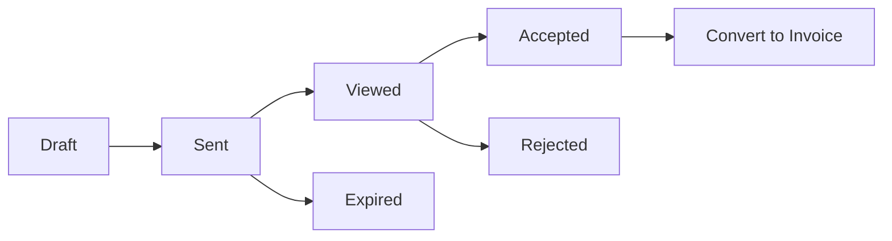
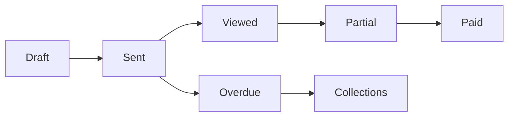

# Fixlify Estimates & Invoices System - Complete Documentation

## 📋 Table of Contents
1. [Overview](#overview)
2. [System Architecture](#system-architecture)
3. [Estimates Module](#estimates-module)
4. [Invoices Module](#invoices-module)
5. [Client Portal](#client-portal)
6. [Communication Features](#communication-features)
7. [Payment Processing](#payment-processing)
8. [API Reference](#api-reference)
9. [Troubleshooting](#troubleshooting)

## 🎯 Overview

The Estimates & Invoices system in Fixlify provides comprehensive financial document management for service businesses, including creation, tracking, communication, and payment collection.

### Key Features
- **Professional Templates** - Customizable estimate/invoice templates
- **Automated Numbering** - Sequential document numbering
- **Email & SMS Delivery** - Integrated communication
- **Client Portal** - Self-service document viewing
- **Payment Integration** - Online payment collection
- **Status Tracking** - Real-time status updates
- **Reporting** - Financial analytics and reports

### Business Benefits
- Faster quote-to-cash cycles
- Improved cash flow management
- Professional client communication
- Reduced administrative overhead
- Better financial visibility

## 🏗️ System Architecture

### Database Schema

#### estimates
```sql
CREATE TABLE estimates (
  id UUID PRIMARY KEY,
  estimate_number TEXT UNIQUE NOT NULL,
  job_id UUID REFERENCES jobs(id),
  client_id UUID REFERENCES clients(id),
  status TEXT DEFAULT 'draft',
  subtotal DECIMAL(10,2),
  tax_rate DECIMAL(5,2) DEFAULT 0,
  tax_amount DECIMAL(10,2),
  discount_amount DECIMAL(10,2) DEFAULT 0,
  total_amount DECIMAL(10,2),
  valid_until DATE,
  notes TEXT,
  terms TEXT,
  created_by UUID,
  organization_id UUID,
  created_at TIMESTAMP,
  updated_at TIMESTAMP
);
```

#### invoices
```sql
CREATE TABLE invoices (
  id UUID PRIMARY KEY,
  invoice_number TEXT UNIQUE NOT NULL,
  job_id UUID REFERENCES jobs(id),
  client_id UUID REFERENCES clients(id),
  estimate_id UUID REFERENCES estimates(id),
  status TEXT DEFAULT 'draft',
  subtotal DECIMAL(10,2),
  tax_rate DECIMAL(5,2) DEFAULT 0,
  tax_amount DECIMAL(10,2),
  discount_amount DECIMAL(10,2) DEFAULT 0,
  total_amount DECIMAL(10,2),
  due_date DATE,
  paid_date DATE,
  payment_method TEXT,
  notes TEXT,
  terms TEXT,
  created_by UUID,
  organization_id UUID,
  created_at TIMESTAMP,
  updated_at TIMESTAMP
);
```
#### Line Items
```sql
CREATE TABLE estimate_items (
  id UUID PRIMARY KEY,
  estimate_id UUID REFERENCES estimates(id) ON DELETE CASCADE,
  service_id UUID REFERENCES services(id),
  description TEXT,
  quantity DECIMAL(10,2) DEFAULT 1,
  unit_price DECIMAL(10,2),
  total_price DECIMAL(10,2),
  sort_order INTEGER,
  created_at TIMESTAMP
);

CREATE TABLE invoice_items (
  id UUID PRIMARY KEY,
  invoice_id UUID REFERENCES invoices(id) ON DELETE CASCADE,
  service_id UUID REFERENCES services(id),
  description TEXT,
  quantity DECIMAL(10,2) DEFAULT 1,
  unit_price DECIMAL(10,2),
  total_price DECIMAL(10,2),
  sort_order INTEGER,
  created_at TIMESTAMP
);
```

#### Supporting Tables
```sql
-- Document numbering
CREATE TABLE id_counters (
  id UUID PRIMARY KEY,
  user_id UUID,  -- NULL for global counters
  counter_type TEXT,
  prefix TEXT,
  next_value INTEGER DEFAULT 1,
  organization_id UUID
);

-- Communication tracking
CREATE TABLE estimate_communications (
  id UUID PRIMARY KEY,
  estimate_id UUID REFERENCES estimates(id),
  type TEXT, -- 'email' or 'sms'
  sent_to TEXT,
  sent_at TIMESTAMP,
  status TEXT,
  portal_link TEXT
);

CREATE TABLE invoice_communications (
  id UUID PRIMARY KEY,
  invoice_id UUID REFERENCES invoices(id),
  type TEXT, -- 'email' or 'sms'
  sent_to TEXT,
  sent_at TIMESTAMP,
  status TEXT,
  portal_link TEXT
);
```

### Document Numbering System

#### Global Counter System
```javascript
// Atomic number generation
async function getNextDocumentNumber(type, prefix = '') {
  const { data, error } = await supabase
    .rpc('get_next_document_number', {
      p_counter_type: type,
      p_prefix: prefix,
      p_organization_id: organizationId
    });
  
  return data; // e.g., "EST-2025-0001"
}
```
## 📝 Estimates Module

### Creating Estimates

#### From Job Page
```javascript
// Component: JobEstimates.tsx
const handleCreateEstimate = async () => {
  const estimate = await createEstimate({
    job_id: jobId,
    client_id: job.client_id,
    items: selectedServices.map(service => ({
      service_id: service.id,
      description: service.name,
      quantity: 1,
      unit_price: service.price,
      total_price: service.price
    })),
    valid_until: addDays(new Date(), 30)
  });
};
```

#### Estimate Builder Interface
1. **Header Section**
   - Client information
   - Job reference
   - Validity period
   - Status indicator

2. **Line Items**
   - Service/product selection
   - Quantity and pricing
   - Description editing
   - Drag-to-reorder

3. **Totals Section**
   - Subtotal calculation
   - Tax configuration
   - Discount application
   - Grand total

4. **Footer Section**
   - Notes to client
   - Terms & conditions
   - Internal notes

### Estimate Workflow



### Status Management
```javascript
const ESTIMATE_STATUSES = {
  draft: { label: 'Draft', color: 'gray' },
  sent: { label: 'Sent', color: 'blue' },
  viewed: { label: 'Viewed', color: 'purple' },
  accepted: { label: 'Accepted', color: 'green' },
  rejected: { label: 'Rejected', color: 'red' },
  expired: { label: 'Expired', color: 'orange' }
};
```

### Sending Estimates
```javascript
// Email delivery
await sendEstimateEmail(estimateId, {
  to: client.email,
  cc: additionalEmails,
  message: customMessage
});

// SMS delivery
await sendEstimateSMS(estimateId, {
  to: client.phone,
  message: customMessage
});
```
## 💰 Invoices Module

### Creating Invoices

#### From Estimate
```javascript
// Convert accepted estimate to invoice
const convertToInvoice = async (estimateId) => {
  const invoice = await supabase
    .rpc('convert_estimate_to_invoice', {
      p_estimate_id: estimateId
    });
  
  return invoice;
};
```

#### Direct Creation
```javascript
// Create invoice directly
const createInvoice = async (jobId) => {
  const invoiceNumber = await getNextDocumentNumber('invoice', 'INV');
  
  const { data: invoice } = await supabase
    .from('invoices')
    .insert({
      invoice_number: invoiceNumber,
      job_id: jobId,
      client_id: job.client_id,
      due_date: addDays(new Date(), 30),
      status: 'draft'
    })
    .select()
    .single();
    
  return invoice;
};
```

### Invoice Features

#### Payment Terms
```javascript
const PAYMENT_TERMS = {
  'net_0': 'Due on Receipt',
  'net_15': 'Net 15 Days',
  'net_30': 'Net 30 Days',
  'net_45': 'Net 45 Days',
  'net_60': 'Net 60 Days',
  'custom': 'Custom Terms'
};
```

#### Late Fees
```javascript
// Automatic late fee calculation
const calculateLateFee = (invoice) => {
  if (invoice.status !== 'overdue') return 0;
  
  const daysLate = differenceInDays(new Date(), invoice.due_date);
  const lateFeeRate = 0.015; // 1.5% per month
  
  return (invoice.total_amount * lateFeeRate * (daysLate / 30)).toFixed(2);
};
```

### Invoice Workflow



### Payment Recording
```javascript
// Record payment
const recordPayment = async (invoiceId, paymentData) => {
  const { data } = await supabase
    .from('payments')
    .insert({
      invoice_id: invoiceId,
      amount: paymentData.amount,
      payment_method: paymentData.method,
      reference_number: paymentData.reference,
      payment_date: paymentData.date
    });
    
  // Update invoice status
  await updateInvoiceStatus(invoiceId);
};
```
## 🌐 Client Portal

### Portal Access
The client portal provides secure, self-service access to estimates and invoices.

#### Direct Links
```
/estimate/:estimateId    - Direct estimate view
/invoice/:invoiceId      - Direct invoice view
/portal/:accessToken     - Token-based portal access
```

#### Portal Features
1. **Document Viewing**
   - Professional layout
   - Mobile responsive
   - Print-friendly format
   - Download as PDF

2. **Client Actions**
   - Accept/Reject estimates
   - Pay invoices online
   - Download documents
   - Add notes/comments

3. **Security**
   - Token-based access
   - Time-limited links (72 hours)
   - IP logging
   - Activity tracking

### Portal Components

#### EstimatePortal.tsx
```javascript
// Key features
- Real-time status updates
- Accept/Reject buttons
- Terms acceptance
- Digital signature (planned)
- Communication history
```

#### InvoicePortal.tsx
```javascript
// Key features
- Payment options display
- Online payment button
- Payment history
- Download receipt
- Dispute resolution
```

## 📧 Communication Features

### Email Templates

#### Professional Design
```html
<!-- Email template structure -->
<table role="presentation">
  <tr>
    <td class="header">
      
      <h1>Estimate #EST-2025-0001</h1>
    </td>
  </tr>
  <tr>
    <td class="content">
      <p>Hi {{client_name}},</p>
      <p>Please find your estimate attached.</p>
      <div class="amount-box">
        <span class="label">Total Amount:</span>
        <span class="amount">${{total_amount}}</span>
      </div>
      <a href="{{portal_link}}" class="cta-button">
        View Estimate
      </a>
    </td>
  </tr>
  <tr>
    <td class="footer">
      <p>{{company_name}} | {{company_phone}}</p>
    </td>
  </tr>
</table>
```
### SMS Templates

#### Format
```javascript
// Estimate SMS
`Hi {{client_name}}, your estimate #{{estimate_number}} for ${{total_amount}} is ready. View it here: {{portal_link}} - {{company_name}}`

// Invoice SMS
`Hi {{client_name}}, your invoice #{{invoice_number}} for ${{total_amount}} is due on {{due_date}}. Pay online: {{portal_link}} - {{company_name}}`
```

### Communication Tracking
```javascript
// Log all communications
const logCommunication = async (documentId, type, details) => {
  await supabase
    .from(`${type}_communications`)
    .insert({
      [`${type}_id`]: documentId,
      type: details.channel, // 'email' or 'sms'
      sent_to: details.recipient,
      sent_at: new Date(),
      status: 'sent',
      portal_link: details.portalLink
    });
};
```

## 💳 Payment Processing

### Payment Methods
```javascript
const PAYMENT_METHODS = {
  cash: { label: 'Cash', icon: 'dollar-sign' },
  check: { label: 'Check', icon: 'file-text' },
  credit_card: { label: 'Credit Card', icon: 'credit-card' },
  ach: { label: 'ACH Transfer', icon: 'building' },
  online: { label: 'Online Payment', icon: 'globe' },
  other: { label: 'Other', icon: 'more-horizontal' }
};
```

### Online Payments (Planned)
```javascript
// Stripe integration
const processOnlinePayment = async (invoiceId, paymentMethod) => {
  // Create payment intent
  const intent = await stripe.paymentIntents.create({
    amount: invoice.total_amount * 100,
    currency: 'usd',
    metadata: {
      invoice_id: invoiceId,
      client_id: invoice.client_id
    }
  });
  
  // Process payment
  const result = await stripe.confirmCardPayment(
    intent.client_secret,
    { payment_method: paymentMethod }
  );
  
  if (result.error) {
    throw new Error(result.error.message);
  }
  
  // Record successful payment
  await recordPayment(invoiceId, {
    amount: invoice.total_amount,
    method: 'credit_card',
    reference: result.paymentIntent.id,
    date: new Date()
  });
};
```

### Payment Tracking
```sql
-- Payment history view
CREATE VIEW payment_history AS
SELECT 
  p.*,
  i.invoice_number,
  i.total_amount as invoice_amount,
  c.name as client_name
FROM payments p
JOIN invoices i ON p.invoice_id = i.id
JOIN clients c ON i.client_id = c.id;
```
## 📡 API Reference

### Estimates API

#### Endpoints
```http
# Estimates
GET    /api/estimates              # List estimates
POST   /api/estimates              # Create estimate
GET    /api/estimates/:id          # Get estimate
PUT    /api/estimates/:id          # Update estimate
DELETE /api/estimates/:id          # Delete estimate
POST   /api/estimates/:id/send     # Send estimate
POST   /api/estimates/:id/accept   # Accept estimate
POST   /api/estimates/:id/reject   # Reject estimate

# Estimate Items
GET    /api/estimates/:id/items    # List items
POST   /api/estimates/:id/items    # Add item
PUT    /api/estimate-items/:id     # Update item
DELETE /api/estimate-items/:id     # Delete item
```

#### JavaScript SDK
```javascript
import { EstimatesAPI } from '@/services/estimates-api';

const api = new EstimatesAPI();

// Create estimate
const estimate = await api.create({
  job_id: jobId,
  client_id: clientId,
  items: [...],
  valid_until: validDate
});

// Send estimate
await api.send(estimateId, {
  email: true,
  sms: true,
  message: 'Please review the attached estimate'
});

// List estimates
const estimates = await api.list({
  status: 'sent',
  client_id: clientId,
  sort: 'created_at:desc'
});
```

### Invoices API

#### Endpoints
```http
# Invoices
GET    /api/invoices              # List invoices
POST   /api/invoices              # Create invoice
GET    /api/invoices/:id          # Get invoice
PUT    /api/invoices/:id          # Update invoice
DELETE /api/invoices/:id          # Delete invoice
POST   /api/invoices/:id/send     # Send invoice
POST   /api/invoices/:id/payment  # Record payment
GET    /api/invoices/:id/payments # Payment history

# Invoice Items
GET    /api/invoices/:id/items    # List items
POST   /api/invoices/:id/items    # Add item
PUT    /api/invoice-items/:id     # Update item
DELETE /api/invoice-items/:id     # Delete item
```

### Database Functions

```sql
-- RPC functions
get_next_document_number(p_counter_type, p_prefix, p_organization_id)
convert_estimate_to_invoice(p_estimate_id)
calculate_invoice_totals(p_invoice_id)
get_overdue_invoices(p_organization_id)
generate_portal_access(p_document_type, p_document_id)
```
## 🔍 Troubleshooting

### Common Issues

#### 1. Duplicate Number Errors
**Problem**: "Duplicate key value violates unique constraint"

**Solution**:
```javascript
// Use atomic counter function
const number = await supabase
  .rpc('get_next_document_number', {
    p_counter_type: 'estimate',
    p_prefix: 'EST',
    p_organization_id: organizationId
  });
```

#### 2. Email/SMS Not Sending
**Problem**: Communications fail silently

**Checklist**:
- Verify edge function deployment
- Check API keys in Supabase secrets
- Confirm phone number active in Telnyx
- Review edge function logs

```javascript
// Debug edge function
const { data, error } = await supabase.functions.invoke('send-estimate', {
  body: { estimate_id: estimateId }
});
console.log('Edge function response:', { data, error });
```

#### 3. Portal Access Issues
**Problem**: Clients can't access documents

**Solutions**:
- Check portal URL configuration
- Verify token generation
- Confirm token hasn't expired
- Test direct links vs token links

```sql
-- Check portal access
SELECT * FROM portal_access_tokens
WHERE document_id = 'your-document-id'
  AND expires_at > NOW();
```

#### 4. PDF Generation Failures
**Problem**: PDF downloads not working

**Solutions**:
```javascript
// Implement client-side PDF generation
import { generatePDF } from '@/utils/pdf-generator';

const pdf = await generatePDF({
  type: 'invoice',
  data: invoiceData,
  template: 'default'
});
```

### Performance Optimization

#### Query Optimization
```sql
-- Add indexes for common queries
CREATE INDEX idx_estimates_client_status 
  ON estimates(client_id, status);
  
CREATE INDEX idx_invoices_due_date 
  ON invoices(due_date) 
  WHERE status != 'paid';
```

#### Caching Strategy
```javascript
// Cache document data
const cacheKey = `invoice_${invoiceId}`;
const cached = localStorage.getItem(cacheKey);

if (cached && !isStale(cached)) {
  return JSON.parse(cached);
}

const fresh = await fetchInvoice(invoiceId);
localStorage.setItem(cacheKey, JSON.stringify(fresh));
return fresh;
```

### Monitoring & Metrics

#### Key Metrics
```sql
-- Financial dashboard queries
-- Average time to payment
SELECT AVG(
  EXTRACT(EPOCH FROM (paid_date - created_at))/86400
) as avg_days_to_payment
FROM invoices
WHERE status = 'paid';

-- Estimate conversion rate
SELECT 
  COUNT(CASE WHEN status = 'accepted' THEN 1 END)::FLOAT / 
  COUNT(*)::FLOAT * 100 as conversion_rate
FROM estimates;

-- Outstanding revenue
SELECT SUM(total_amount) as outstanding
FROM invoices
WHERE status IN ('sent', 'viewed', 'overdue');
```

## 📋 Best Practices

### Document Management
1. **Always use atomic counters** for numbering
2. **Include clear terms** on all documents
3. **Set appropriate validity/due dates**
4. **Track all communications** for audit trail
5. **Archive old documents** rather than delete

### Client Communication
1. **Send immediately** after creation
2. **Follow up** on viewed but not actioned
3. **Personalize messages** when possible
4. **Provide multiple contact methods**
5. **Include clear CTAs** in all communications

### Financial Health
1. **Monitor aging reports** regularly
2. **Act on overdue invoices** promptly
3. **Track conversion metrics** for estimates
4. **Analyze payment patterns** by client
5. **Optimize payment terms** based on data

---

*For additional support or feature requests, consult the development team or refer to the implementation files in `/src/components/jobs/estimates/` and `/src/components/jobs/invoices/`.*